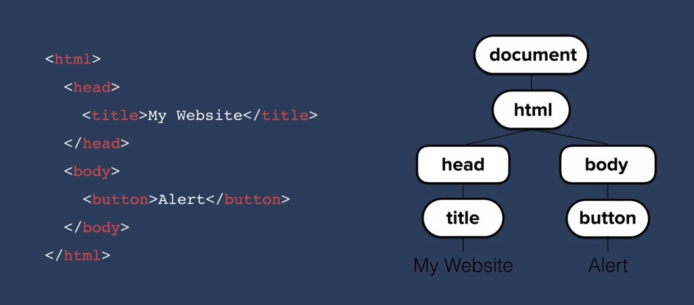
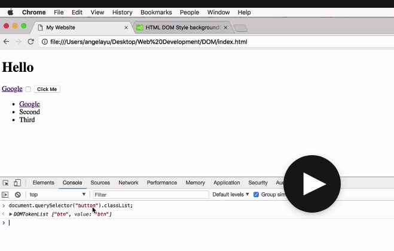

# SECTION 1: PREAMBLES

> Note: Links to most of the resources in this web development course can be found here: https://www.appbrewery.co/p/web-development-course-resources


## Section 1(4) - 12 Rules to learn code
1. Trick your brain with the 20 minute rule
2. Code for a purpose
3. There is no perfect programming language 
4. Understand what you're writing
5. It's OK to not know 
6. Be a copy cat
7. Be accountable
8. Keep learning
9. Play Foosball
10. Get a mentor
11. Get into the habit of chunking
12. Break someone else's code

_Credit: Angela Yu, Lead Instructor at the App Brewery_

## Section 1(7) - How to get the most out of this course
- Don't code along. Instead, watch the video and then reflect on your understanding of the content. Query why a code is written and preempt the result you expect to see. 
- Take notes after those 10 minutes of watch for understanding. These notes will become valuable to you in your journey.
- Then get on your code editor and try to replicate what you have just watched, without looking at the code from the video. Iterate if necessary.
- Review your notes and pick out questions and keywords that you want to research on later. You can also include memory hints for yourself. 
- Change the playback speed to fit your requirements.
- Try not to skip any lessons. You can playback at a higher speed if you find some content too easy.
- Rewatch videos that you find difficult. If you still don't understand some aspects after rewatching, bookmark it and take some time to research around the topic. If you come back to the same video after a couple of days of researching, it will become much easier to understand.
- Practice and perseverance leads to mastery.
> Embrace situations where you struggle or get stuck. Use tools like Google and stackoverflow to get unstuck. Enjoy that feeling that comes when you finally solve a problem. `Consistent practice leads to mastery!`
```
Will you quit when you get stuck? Remember that good programmers just stare at the screen more than half of the time! You will be hired to solve problems, so get used to the stuck-unstuck cycle. Enjoy it!
```
***
## MY BACKLOG

* https://eslint.org/

* https://www.frontendmentor.io/challenges/space-tourism-multipage-website-gRWj1URZ3
* Practice wire framing with https://balsamiq.cloud/sio79i5/projects.
* Install hyperTerminal
***

# SECTION 2: INTRODUCTION TO HTML 

https://code.visualstudio.com/shortcuts/keyboard-shortcuts-windows.pdf
https://docs.emmet.io/cheat-sheet/ 

Use `<br>` to insert a blank line or to move content to the next line. This does not require the closing tag. The break tag `<br>` is a self-closing tag. Use the horizontal rule `<hr>` to draw an horizontal line. This is another self-closing tag. 

The head holds information about the web page and tells the browser how it should handle the page. The image tag is also self-closing. 

```
 img -> HTML element | src="" -> HTML attribute.
```

Asides hosting pics on sites like FB/ LinkedIn, images can also be saved directly into the project folder. So, source will be something like:

> ``. If I had an images folder, then I would have to add a path like so: `"images/seun.png"`.

### Please review the docs for the image element: https://developer.mozilla.org/en-US/docs/Web/HTML/Element/img

### Also check out: The list element (and related elements ol, ul, menu) https://developer.mozilla.org/en-US/docs/Web/HTML/Element/li

### 

> Side notes:
Regular review of documentation is very vital to your journey. Make it a daily habit if possible. Some good sources include https://developer.mozilla.org/en-US/ , https://devdocs.io/ , https://www.w3schools.com/.

Go and master the shortcuts on emmet https://docs.emmet.io/cheat-sheet/ and your choice code editor https://code.visualstudio.com/shortcuts/keyboard-shortcuts-windows.pdf.

You can upload your images to https://photobucket.com/explore . To quickly get circular cuts of images, you can use https://crop-circle.imageonline.co/ .

## HTML Links and Anchor Tags
The HT (hypertext) in HTML is executed with "a" tags. Anchor tags are extremely important in web development. The href is the hyperlink reference.

> `<a href="https://...">Hello</a>
<a> -> HTML element | href -> HTML attribute | https://... -> Link destination | Hello -> Link Text. `

You can use a tags to create satellite pages that link back to your index.html such that you have a website rather than just a web page.

> `<><a href="mailto:seun.oshitade@gmail.com">Email Me </a><p>`

>`<><a href="tel:77777777">Telephone</a><p>`

### You should definitely review the entire a- tag documentation on MDN. It's worth it. Afterall, HTML is all about links, right?  https://developer.mozilla.org/en-US/docs/Web/HTML/Element/a

### Complete the goal-setting framework that has been provided.

# My favorite shortcuts
### Collect favorite shortcuts here. The ones that I actually use all the time!

## VS Code
1. Copy or cut entire line without highlighting. cmd+c and cmd + x respectively
2. cmd + direction to move to the very end of row or page.
3. Command palette - Instead of cmd + shift + p, just hit F1!

## My Mac
1. Emoji Keyboard: cmd + ctr + space. Or better still, just type the function key (based on my set preferences)!
2. Page down on Mac: fn + down-arrow.

## Emmet
1. For all elements, just start typing the element name and hit enter
2. If you want 6 divs, type div*6 + enter. Applies to any other element

# SECTION 3 
## HTML TABLES 

### Docs - https://developer.mozilla.org/en-US/docs/Web/HTML/Element/table ; https://developer.mozilla.org/en-US/docs/Web/HTML/Element/form

While the main job of tables is to display structured data, it can be used to affect the layout of various HTML elements on a web page. Alot of styling attributes of tables are better handled with CSS. They are therefore mostly deprecated. Tables have three main components: <thead>, <tbody> and <tfoot>. In practice, only the first two are often used. Each component consists of rows <tr> and cells to hold the data - <th> and <td> in the <thead> and <tbody> elements respectively.

`Note that table cells are wrapped in <tr> elements. No columns.`

Here's an example of what a table layout might look like:
```javaScript
<table>
  <thead>
    <tr>
      <th>Insert info here</th>
      <th>Insert info here</th>
    </tr>
  </thead>
  <tbody>
    <tr>
      <th>Insert info here</th>
      <th>Insert info here</th>
    </tr>
  </tbody>
  <tfoot>
  </tfoot>
</table>
```
Using tables for layouts is not a great idea. There are more powerful tools. Note that you can easily introduce padding in your tables by using the cellspacing property, e.g. `<table cellspacing="20">`.

`The various sub-elements for tables are valuable when styling with CSS. Tables can also be used for layouts including images, texts, and so on.` The code used in my basic html-based exercise site illustrates the use of tables (and forms). https://github.com/s-oshitade/html-personal-site.

## HTML FORMS

### Official docs - https://devdocs.io/html/element/form . To be reviewed!
MDN reference for HTML: https://developer.mozilla.org/en-US/docs/Web/HTML/Reference 

Sample from my exercise: https://github.com/s-oshitade/html-personal-site/blob/main/contact.html `(Lines 16 - 24)`

Angela Yu on forms - 1: https://www.udemy.com/course/the-complete-web-development-bootcamp/learn/lecture/12287490#questions

Angela Yu on forms - 2: https://www.udemy.com/course/the-complete-web-development-bootcamp/learn/lecture/12287496#questions

# SECTION 4 - INTRODUCTION TO CSS 

### Docs - https://developer.mozilla.org/en-US/docs/Web/CSS/Reference. Check out the article on background color. https://developer.mozilla.org/en-US/docs/Web/CSS/background-color 
CSS broder-style: https://developer.mozilla.org/en-US/docs/Web/CSS/border-style

Checkout the stanford css cheat sheet here: https://web.stanford.edu/group/csp/cs21/csscheatsheet.pdf

`You must make a habit of looking up stuff for yourself on google. There's no other way to survive as developer!`

Look up named colors here https://developer.mozilla.org/en-US/docs/Web/CSS/color_value. Highly recommended for bookmark! You will also find the corresponding HEX values.

CSS's only purpose is to style mark-up language such as HTML, XML. 

There are 3 ways to use CSS: inline, internal CSS and external CSS links. The latter is the recommended approach.
### A tool for finding beautiful colors and color palattes is called https://colorhunt.co/.

Examples:
1. Inline: `<body style="background-color:blue;">`

2. Internal: In the `<head>` element:

`<style>
 body {
   background-color: #EAF6F6;
 }
</style>`

Note that there are some default CSS styles applied by your browser. You can use Google to look this up. WS3 has a good section on this.On the chrome devtool -> Inspect -> Styles, you will find this as "user agent stylesheet".

> One of the most important concepts in learning CSS is realizing that pretty much everything that exists on the web page are essentially just boxes. Use the pesticide chrome extension to see those boxes on your browser.

You can use percentages to represent size.

3. External
`<link rel="stylesheet" href="css/styles.css">`

> Very important CSS lessons can be found in the debugging exercise here: https://www.udemy.com/course/the-complete-web-development-bootcamp/learn/lecture/12287560?start=165#questions

Arrange css rules in alphabetical order, especially when the list gets long. It makes debugging easier.

There are so many properties on CSS. Don't try to memorise them. Just use the index [here](https://developer.mozilla.org/en-US/docs/Web/CSS/Reference) . 

This site is great for emojis - https://emojipedia.org/.

border-radius: 100% -> circular

## CSS Selectors
css selectors: tags, classes, ids. -> Increasing selectivity. 

To target tags, just use the tag name directly. To target classes and ids, use `.` and `#` respectively.

## Classes vs. Ids

When there are conflicting rules, ids overrule classes and classes overrule tag selectors. You can see these using the chrome dev-tool: Over-ridden rules are striked out.

>You can only have a single instance of one particular id name inside a single page. Ids must be unique. Use ids to apply a specific style to a single element on a page. Whereas you can use a given class multiple times on a page. So you can use classes to group related elements that should follow the same css rule(s). 

The analogy of name and passport number is apt. Many people can have a particular name, but your passport number should be unique to you.

You can't have more than one id for a particular element. `<h1 id="heading big"> wil not work`. But any HTML element can have more than one class. While tag and class selectors are widely used, id selectors are used more sparingly.

`Another interesting feature regarding css selectors is something called a pseudo-class.`


>If you have a look at some of the properties in the css reference [here](https://developer.mozilla.org/en-US/docs/Web/CSS/Reference), you will find that some them start with a colon, such as `:active`. These are called pseudo classes. And this is because HTML elements can have different states.

For instance, you can get a css element to change based on whether you're hovering over a piece of text or an image or not. These are two different states: `hovering over` or `not hovering over`.

The pseudo-element that you will most commonly find is the hover element. Read the documentation on [click](https://developer.mozilla.org/en-US/docs/Web/CSS/:hover).

```javascript
/* Selects any <a> element when "hovered" */
a:hover {
  color: orange;
}
```
# INTERMEDIATE CSS
The previous personal website won't get us hired! It looks more like a computer science professor's CV website.😃

Let's make something that is inspired by [Sean Halpin's personal website](https://web.archive.org/web/20180819202235js_/http://seanhalpin.io/).

You can link a css stylesheet like so:
`<link rel="stylesheet" href="css/styles.css" type="text/css">`

The type="text/css" is optional but you must make accurate reference to the location of the css file, i.e. href (hypertext reference).
## FAVICONS
To create a favicon (favorite icon), go to https://www.favicon.cc/.

Link your favicon like so:
 ` <link rel="icon" href="favicon.ico">`

Using `Pesticide`, hold down control and hover on the boxes. You will see some information at the foot of the page, about the element that you're hovering on.
## HTML DIVS
You can use divs to structure your html elements into separate `container`s or boxes that can be styled separately. 

`div` stands for Content Division Element. The div can have a height based on the css rule that you apply to it. But when it has content, a div is also able to assume a height that is just sufficient to `CONTAIN` the elements within it.

You can use the chrome dev tools -> inspect -> Elements -> styles to experiment and test out the changes that need to be made. What you see is what you get. ONce you're satisfied with what you can see, you can then head over to your css and implement it.

## THE BOX MODEL OF WEBSITE STYLING!💪
Every single element on screen is treated as a box by CSS. By styling that box - it's height, padding, margin, etc - that's how we can the determine how the elements can be laid out and how they will show up on a screen. This concept is known as The Box Model.

When a div container has no content, then it will have no dimension unless you specify css rules, e.g. height and/or width.

Padding makes the element 'look' different in size, but margin does not. That's because the padding takes the background color of the element, so it pads the content. While the margin does not take the color of the element, it pushes away other elements and creates a space between elements.
### The border
The [border](https://developer.mozilla.org/en-US/docs/Web/CSS/border) is a very important aspect of a box. The border shorthand CSS property sets an element's border. It sets the values of [border-width](https://developer.mozilla.org/en-US/docs/Web/CSS/border-width), [border-style](https://developer.mozilla.org/en-US/docs/Web/CSS/border-style), and [border-color](https://developer.mozilla.org/en-US/docs/Web/CSS/border-color). Please read each of the linked docs - border, border-width, border-style, border-color. Also review the reference for margin and padding. With these, you will be able to handle the CSS box/container well.

Here's a lecture on [The Box Model](https://www.udemy.com/course/the-complete-web-development-bootcamp/learn/lecture/12287726#questions/8856680). Please re-watch!

## THE CSS DISPLAY PROPERTY
The display property has four different values.
1. `Block` elements such as `<p>`, `<h1 - h6>`, `ul, ol, <hr, article, section, div`
2. `Inline`, such as span, img, `<a>`
A major issue with the inline elements is that you can't set the width to a particular value. It won't respond. On the other hand, block elements allow you to set the width but it won't allow multiple elements to sit on the same line.
3. If you change the display to `inline-block`, then you get the best of both worlds. Images are typically handled as inline block elements.
4. `display: none`. This removes such element from the website.
Quite similar to display: none, there's a property called visibility. When the property `visibility` is set to a value of hidden, The element disappears but its original position is kept.

## CSS STATIC AND RELATIVE POSITIONING

...Exploring css positioning in more detail. It's important to note that: even without css, our html has pre-defined rules for how it should be displayed on your webpage. 

`We have to understand how things get positioned by default before we can go on to change it and bend it  to our rules without getting confused or stuck.`

- Rule #1: Content is everything. Inline elements only take as much width and as much height as the content. So if you have a span that contains a long word, then you will have a short width. And if you have a span that contains a loong word, then you will have a long width. With block elements, even though they take a 100% of the width, the height is still determined by the content. So your content is the first thing that determines how large things gets displayed and what the height and width will be. And this is despite any CSS.
- Rule #2: The order of your elements on-screen comes from your HTML code.
- Rule #3: Children sit on top of top parents. So if you image that you have X, Y, Z dimensions, with the z dimension reprenting closeness to the user relative to the screen. A paragraph that is nested in a div would be closer to the user than the div.
These 3 rules determine the placement of objects on the screen, just based on HTML.

`POSITION: With CSS, you can POSITION elements on the screen the way that you want. Most times, you would need to do this as a developer.`

There are multiple ways to change the Position property of elements with CSS. They include (among others):
1. Static - Default.
2. Relative - Position relative to where the element shoud lhave been by default.
3. Absolute - Position relative to parent. Absolute positioning takes element out of the flow of HTML, unlike relative positioning that leave the 'ghost' of the element behind.
4. Fixed: A fixed element stays in its position even when you  scroll through a web page. For instance, it can be implemented like so:

```javascript
.className {
  position: fixed;
  top: 0;
}
```

The position property uses four coordinates - top, right, bottom, left. Think of these coordinates as special margins. 

`You can use containers (e.g. divs) to fine-tune the position of elements on screeen by using a combination of relative and absolte positioning.`

## THE DARK ART OF CENTERING ELEMENTS
The easiest way of centering elements is by tapping into a property called `text-align`.This property has to be set inside of a parent container, such as the body.
```javascript
body {
  text-align: center;
}
```
This works as long as we've got inline block elements sucha as images, or if we've got full-width block elements like h1 or p tag.

When you set a width property for a child element of the body in the example above, then the text-align rule would not apply to such child element.
In such a case, you can still center to the child element by using `margin-auto`.

As an example further to the one above:
```javascript
h1 {
  width: 10%; // this takes our h1 element out of the influence of the text-align above
  margin: 0 auto; //sets the element to be horizontally centered on display.
}

```

With reference to the css-site example, our bottom cloud has an absolute position. In order to position it relative to something, then one of the parents has to have its position set to relative, and if we don't, then it will be relative to the body.

## FONT STYLING

There are two very important decisions that you have to make in web development:
1. A color palatte, and
2. A font scheme

There are 5 major font families listed on our code editor - Serif, Sans-serif, monospace, cursive and fantasy. monospace is good for reprensting code.  For most browsers, the default serif is the times font, and the default sans-serif is Arial.

Use https://www.cssfontstack.com to check out the usage of fonts.You can easily copy font families and ``stack of fallbacks` here. Use a font stack to influence how you're site is rendered when a user doesn't have your primary font installed on their machine. 

`To ensure that EVERYBODY has the same experience on your website, then use something called  FONT EMBEDDING.` Refer to https://fonts.google.com/. After selecting preferred fonts, copy and paste the `<link>` to your html. This will take users that don't have the fonts installed, to the ref site. And then copy/paste the css rules accordingly, to specify how your selected fonts should be applied to the body and/or specific elements on your site.

`Aside` - Use lorem ipsum to set up your websites when you haven't gotten content for the txt yet. Just type lorem on your code editor and enter. You can also use the * operator to speicify how much of lorem content you need before you hit enter. You will find the following sites useful: https://loremipsum.io/ , lorem-ipsum.perbang.dk . For images, check google or got to https://www.flaticon.com. There are more than half a million icons. Download as png.You can also right-click and copy the image address to your src. For animated GIFs, head over to giphy.com. If you select the sticker tages, then your background colors will go all around it. 

## CSS Sizing
* Percentages can be used for sizing. This is one way of achieving dynamic sizing.

  `100% === 16px`
* Another way to size dynemaically is the use of `em`. This should not be confused with the em tage in HTML which is used for emphasis/ italics. Historically, the `em` was the width of the capital letter `M`. This is no longer true. What is true though is that 

  `1em === 16px`

`Aside`: Make a habit of inspecting the sites of great companies like Uber, TechCrunch, Airbnb, Netflix, etc. Use your dev tools to check out their code and tinker around with it. You stand to learn alot!

With zoom, it doesn't matter if your website is statically or dynamically sized because the zoom will scale your entire content accordingly.

> `An important consideration:` When you're using em or percentages, that value is inherited. So if the parent (e.g. body) specifies a font size of 2em, and the child indicates 5em, then the font displayed will factor in the sizes mentioed in the parent and child elements. This can distort our content. This `rem` solves this by ignoring the parent size. `rem` is relative to the root, not the parent/ enclosing container. `1rem is always === 16px`. So `rem` dos not get affected by upstrem size changes.

```javascript
//rem is recommended as the most adaptable and least error-prone unit for dynamic sizing.
```

## My top dozen css properties
```javascript
/*
Here's a list of my top dozen css properties. I will take the time to review the full documentation for these properties [here](https://developer.mozilla.org/en-US/docs/Web/CSS/Reference).

  - margin
  - border
  - padding
  - display
  - position
  - font-weight
  - line-height
  - font-family
  - flex
  - box-sizing
  - width, height
  - z-index

  OTHERS:
  - Text decoration
  - color
  - hover
*/
```

## CSS FLOAT AND CLEAR
Use the float property to wrap texts around an image. You also get to decide where the image should float relative to the texts. So the values for the `float` property can be float: left; right; or none. [Docs](https://developer.mozilla.org/en-US/docs/Web/CSS/float).

"The float CSS property places an element on the left or right side of its container, allowing text and inline elements to wrap around it. The element is removed from the normal flow of the page, though still remaining a part of the flow (in contrast to absolute positioning)".

To prevent the text from wrapping around the image, then use the `clear` property. Think of the clear as the anti-float.

"The clear CSS property sets whether an element must be moved below (cleared) floating elements that precede it. The clear property applies to floating and non-floating elements."

`Float is often abused. Don't use it for positioning. This will save you from headaches that could result from the side-effects of the Float property.`

The float lecture is worth re-watching on [click](https://www.udemy.com/course/the-complete-web-development-bootcamp/learn/lecture/12287672#overview).

`Aside` - The [CSS button generator](https://css3buttongenerator.com/) is amazing and should be used regularly.

## GET MORE PRACTICE! SEE NOTE BELOW FROM ANGELA.

> Hey,

In our in-person bootcamps, I often encourage students to practice the skills they've acquired. Because after all, it's practice that turns a beginner into a master.

So why not try your hand at some of these optional front-end challenges and get more practice with HTML and CSS?

https://www.frontendmentor.io/challenges/space-tourism-multipage-website-gRWj1URZ3

Angela

Tip from Angela on [click](https://www.udemy.com/course/the-complete-web-development-bootcamp/learn/lecture/17966538#questions).
***
# SECTION 6 - INTRODUCTION TO BOOTSTRAP
## WHAT IS BOOTSTRAP?
Bootstrap is a frontend library. It's a bunch of code that can make website design much easier. 


Originally developed by Twitter, it is now free and open source. It's one of the most-starred repos on Github. It is THE most popular frontend framework/ library.

It enables you to make your site responsive. Will bootstrap, you will be able to change your layout depending on the size of the device/ view port. It also goves you access to a bunch of pre-styled elements that you can easily drop into your code/ site.

`Unlike codepen`, [codeply](https://www.codeply.com/) `is a playground that allows you to include frameworks like react, bootstrap, vue, Tailwind, etc.`

## INSTALLAING BOOTSTRAP

https://getbootstrap.com/docs/5.1/getting-started/introduction/#quick-start

The simplest way to use Bootstrap is to copy the bootstrap cdn and paste it as a linked css stylesheet. CDN means content delivery network. The CDN cuts down on latency or how long it would take to load the website. Because of the popularity of bootstrap, your customers probably already have the files cached on their browsers.

Another way is to copy and paste the `Starter Template`. Note that the starter template usese some JS and jQuery.

The third way to use B is to download the CSS and JS source code and include them as relative files in your project. Caching does not occur in this scenario.

In the remainder of this course, we will use option 1. For your projects in the future, option 2 is recommended. The starter code ensures tha you have everything you need to maximally leverage Bootstrap.
Installation video available on [click](https://www.udemy.com/course/the-complete-web-development-bootcamp/learn/lecture/12287996#questions).

## WIREFRAMING
A wireframe is a low fidelity representation of your proposed website. It enables iteration and buy-in on the design before implementing the website/app.

A mock-up is a HIGH fidelity representation. What you see is what you get.

Workflow
* Check out UI patterns at ui-patterns.com. Look at other people's websites.
* Wireframe
* Mock-up. If you want to go the extra mile, you can even create an animated prototype. A really good resource for getting inspiration on all these is https://dribbble.com/.
`dribbble.com is a fantastic place to get inspiration for your site!`

* Pencil and paper is a great way to do your wireframing. Use sneakpeekit.com to print out accurate view ports for your device of interest.
* For more advanced wireframing, https://balsamic.cloud is the indiustry standard. It's quick and collaborative.

***
# SECTION 9 - INTRODUCTION TO JAVASCRIPT ES6.
`Caveat - My JS notes will be very lean as I have learned alot of JS already`.

# SECTION 11 - THE DOCUMENT OBJECT MODEL

## ADDING JAVASCRIPT TO WEBSITES
There's no point writing javaScript codes if we don't know how to incorporate it into our websites, right? Recall the 3 ways to incorporate CSS into websites? Well javascript works very similarly -> 
1. Inline
2. Internal
3. External

We can add inline js by simply adding an attribute to html element. For example:

```javascript
<body onload="alert('Hello');"> 
  <h1>Hello!</h1>
</body>
// note the careful use of double and single quotation marks.

```
This means that whenever the body element gets loaded up, then whatever javascript code that exists between the double quotation marks gets carried out. This is not good practice. It's not modular and very difficult to debug.

The internal approach involves the use of a script tag, like so:

```js
<script type="text/javascript">
  alert("Hello");
</script>
```

This is done in the body of the html.

Lastly, we can incorporate JS into html by using linking to an external source as shown below. This is usually inserted on the line just before body closing tag.

```js
<body>

 //Insert other lines of code here.

  <script src="index.js" charset="utf-8"></script>
</body>

/*index.js
  alert("Hello");
*/

```

`The position where introduce the js script matters a huge deal.`

Interesting: From index.js, you can change the content of the innerHTML from Hello to Goodbye. Learn more about selcting and manipulating HTML content in the next couple of sections.

## INTRODUCTION TO THE DOCUMENT OBJECT MODEL
With HTML and CSS, you can build a static website. But you need your website to be interactive. This is the problem that the DOM solves. It basically cataloues the webpage (HTML) into individual objects that we can select and manipulate.


The task of converting the html into  the DOM is done by the web browser when you load your web page.



What it does is that it turns each of the html elements into and their associated data into a tree structire with a bunch of objects which you can select and manipulate. The reationship between the html elements is mapped out in the tree diagram.

Everything that is contained inside your html is contained in an object called the "document".

Our objects inside the DOM can have properties and actions. You can use the dot notation to select objects in the DOM and manipulate their properties and/or methods.

> On the DOM, we can:
* GET properties 
* SET properties by using the `=` to assign a desired value
* CALL a method on a selected object 


`The key takeaway here is that we can access the properties and methods by using the dot notation, and by so doing we can manipluate the object.`

Angela's introduction to DOM manipulation is worth rewatching!...on [click](https://www.udemy.com/course/the-complete-web-development-bootcamp/learn/lecture/12374120#questions/11415058).

Useful sidenotes - Some other syntax to access the nth child of an object.


## SELECTING HTML ELEMENTS WITH JAVASCRIPT

The use of querySelector to access DOM objects was introduced in the last [section](https://www.udemy.com/course/the-complete-web-development-bootcamp/learn/lecture/12374120#questions/11415058). Other ways include:

1. document.getElementsByTagName("li")[n]
2. document.getElementsByClassName("btn")[n]

Note  that in "1" and "2" above, "Elements" is in `plural` form, and the result is an `array`. Hence you have to use the bracket notation to access the array element of interest using the bracket notation. This must be done even if there is only one element in the array, in which you will access it at index 0.

3. document.getElementById("title")
This is sigular and a single item is returned, not an array. Therefore, this would work fine: 

// document.getElementById("title").innerHTML = "Good Bye";

4. document.querySelector("")
The query selector approach is a much more approach as you can combine (for instance) a tag with a class to reach a specific element, and so on. Unlike 1 - 3, you can use the 4th approach to select an element, a class or an id. The selector should follow the exact format that you use for selection in CSS. You can combine to selectors to achieve higher specificity like so:
document.querySelector("li a"); 
When selecting a list item that is also inside a class "item" on the same level, you can select like so:
document.querySelector("li.item). Note that there's no space between li and item. This applies to the following example: 
`<li class="item"><a href="https://www.google.com">Google</a></li>`.

When you're not specific enough with the querySelector, it returns only the first item that matches. If you want to return ALL the matching items, then you will have y=to use `querySelectorAll` instead. To get specific using this array from `querySelectorAll`, you can use the bracket notation.

```js
You can use querySelector and querySelectorAll to achieve most of selection needs when working on the DOM.
 
```

## MANIPULATING AND CHANGING STYLES OF HTML ELEMENTS WITH JAVASCRIPT

When you're trying to change the property names of your html using javascript, you will find that the names are sometimes different from what you see in CSS. For instance, `font-size` will appear as `fontSize`. Notice the camel casing. Use this [link](https://www.w3schools.com/jsref/dom_obj_style.asp) as a guide for writing property names in js.

Also notice that the ALL the values have to be specified as strings. Even numbers.

## THE SEPARATION OF CONCERNS
In practice, we have to stay conscious of the following with respect to our :
1. HTML is for content
2. CSS is for style
3. JS is for behaviour

We've obviously not been following this rule closely because we have been changing styles of elements using JS.

> The thing is we have to make some style chnages on the fly to make our site interactive. There's a way to achieve this while maintaining separation of concerns!🤫 😉

```js
//Use the following code snippet for the explanations of DOM concepts:
//

```


1. Manipulating styles with ClassList: 

This is a property of every DOM object.

For example:



We can .add, .remove or. toggle specified classes.

For example, you can create styles for class .huge on the styles.css sheet, then manipulate the DOM as provided below:

`document.querySelector("h1").classList.add("huge");`

This way, our style is still in our style sheet and our behanviour is still in our JS.

2. Manipluating Text.

We already know about innerHTML. There's something called `.textContent`. The innerHTML will literally return the html, including the tag if it is nested. But .textContent will only return the text, even if nested.


3. Manipulating Attributes of html elements.

You can: 
* view attributes: `.attributes`,
* get specified attributes: `.getAttribute("insert attribute name")`, and 
* set attributes to preferred values: `.setAttributes("which attribite do you want to change, what do you want to change it to")`


`Angela's tip - Trick your brain with the 20-minute rule. Overcome the inertia to starting and leverage the intertia to stop!`

Completed challenge on click: [dice-game ](https://github.com/s-oshitade/dice-game-domManipulation)!

# SECTION 12 - CHALLENGE: THE DICEE GAME

Here's my code for the dice game:

```js
const randomNumber1 = Math.floor(Math.random() * 6) + 1;
const randomDiceImage1 = `images/dice${randomNumber1}.png`;
document.querySelectorAll("img")[0].setAttribute("src", randomDiceImage1);

const randomNumber2 = Math.floor(Math.random() * 6) + 1;
const randomDiceImage2 = `images/dice${randomNumber2}.png`;
document.querySelectorAll("img")[1].setAttribute("src", randomDiceImage2);

randomNumber1 > randomNumber2 ? document.querySelector("h1").innerHTML = "🥳 Player 1 Wins!" :
randomNumber1 < randomNumber2 ? document.querySelector("h1").innerHTML = "Player 2 Wins 🥳!" : 
document.querySelector("h1").innerHTML = "Draw!";

```

Angela's tip on click: [Learn before you eat!](https://www.udemy.com/course/the-complete-web-development-bootcamp/learn/lecture/17966986#questions/11590714)

# SECTION 13 - ADVANCED JAVASCRIPT AND DOM MANIPULATION

In this section, we used the [drum-kit](https://github.com/s-oshitade/drum-kit) challenge to review key js concepts, such as event listers, higher order functions, callback functions, animation, etc.

## ADDING EVENT LISTENERS TO A BUTTON

The image below is a screenshot from the static form of the website. Nothing happens when you click on the buttons.


In order to start registering the button clicks, I need to add an event listener to it, so the button will let me know when a user clicks on it.

Inside index.html, first create a function (handleClick) that does something when a button get clicked. We basically want our button to trigger this function when it receives a click.

`In order to that, we first need to select our button inside the html and add an event lister that listens for when it gets clicked; and when it does - to call this function called handleClick`.

At this point, please go an review the docs for EventTarget.addEventListener() on [click](https://developer.mozilla.org/en-US/docs/Web/API/EventTarget/addEventListener). 

`Make a habit of checking the docs when you're using a new method or property`.

The `target` in ths case is the button. Click on [this link](https://developer.mozilla.org/en-US/docs/Web/Events) to see all the different event types that you can listen to. In our case, we're simply interested in the [click event](https://developer.mozilla.org/en-US/docs/Web/API/Element/click_event).

The addEventListener() method takes two parameters:

1. `Event Type`: In this case, the `click` event which is represented as a case-sensitive string; and
2. A `listener`. In our case, the listener is the function that will be called when that click event gets detected. In our case, the listener is `function handleClick`.
```js
document.querySelector("button").addEventListener("click", function (){
  alert("I got clicked");
})
```
But this only selects the first button. You will need to use a loop, like so:

```js
  const numberOfDrumButtons = document.querySelectorAll(".drum").length;

  for (let i = 0; i < numberOfDrumButtons; i++){
    document.querySelectorAll(".drum")[i].addEventsListener("click", function () {
      alert("I got clicked!");
    });
  }
```

[This 14-minute video](https://www.udemy.com/course/the-complete-web-development-bootcamp/learn/lecture/12383942#overview) clearly breaks down how to add event listeners to buttons. Watch it again!

## HIGHER ORDER FUNCTIONS AND PASSING FUNCTIONS AS ARGUMENTS

Watch [this video](https://www.udemy.com/course/the-complete-web-development-bootcamp/learn/lecture/12383962#overview) (from 4:00) to learn the thinking behind the development of a calculator using higher order functions and arguments. By combining my knowledge of event listeners and higher order functions, I think I can code up a fully functional calculator if I spend some time on it. 🙂
Also look out for the use of chrome debugger feature.(8:30)

```js
//Calculator function - Tinker on chrome dev tool and add some more functions to the calculator.

//Use the debugger to step through how it works.

const add = function (num1, num2){
    return num1 + num2;
}

const subtract = function (num1, num2){
    return num1 - num2;
}

const divide = function (num1, num2){
    return num1/num2;
}

const multiply = function (num1, num2){
    return num1 * num2;
}

const calculator = function (num1, num2, operator){
    return operator(num1, num2);
}
//calculator(2, 7, add) = 9
//calculator(9, 2, multiply) = 18

//etc
```
These types of functions (like `function calculator` above) that can take other functions as input are called Higher Order Functions. This feature is available in a number of programming languages, but not all languages feature higher order functions. It's available in JS, Java, Ruby, Python, Haskell, C++, PHP, C#, Go, Swift. We will rely on it heavily in JS as we learn to manipulate the DOM and give our websites/apps more and more behavior.

## HOW TO PLAY SOUNDS ON A WEBSITE

Do yourself a favor and watch the video [here](https://www.udemy.com/course/the-complete-web-development-bootcamp/learn/lecture/12383968#questions/8782272).

We've previously responded to click events on our drum kit with an alert. Now, we are going to respond by playing appropriate sounds.

You can easily do this by creating a new audio object, pass in the name of the file that you want to play, and then call the method `play` on the new audio object.

The syntax is as follows:

```js
const audio = new Audio ('audio_file.mp3');
audio.play();

// This uses the HTMLAudioElement. You can look up the docs for the HTMLAudioElement, but App Academy's explanation is sufficient for the topic under consideration.
```
Like the audio code snippet above, you will find very helpful code snippets on stackoverflow or even from other developers in your network. What is important is that you study the code (really find out what the code does) and then you adapt it to your own project. The above code snippet has been incorporated into my drum kit project as shown below. Spot the use of `switch` - a syntax that I find quite annoying! 😄  This scenario presents a good use-case for `switch`. Multiple (or nested) `if` statements wouldn't be looking any better in this case. Also spot the ue of `this` to make reference to the object that triggered the event. Lovely! 😎

Still having issues with `switch`? Check the video [here](https://www.udemy.com/course/the-complete-web-development-bootcamp/learn/lecture/12384090#overview):

```js
  const numberOfButtons = document.querySelectorAll(".drum").length;

for (let i = 0; i < numberOfButtons; i++) {
  document.querySelectorAll(".drum")[i].addEventListener("click", function () {
    let buttonInnerHTML = this.innerHTML;
    switch (buttonInnerHTML) {
      case "w":
          const tom1 = new Audio('sounds/tom-1.mp3');
          tom1.play();
       break;

      case "a":
        const tom2 = new Audio('sounds/tom-2.mp3');
        tom2.play();
      break;
      
      case "s":
        const tom3 = new Audio('sounds/tom-3.mp3');
        tom3.play();
      break;

      case "d":
        const tom4 = new Audio('sounds/tom-4.mp3');
        tom4.play();
      break;

      case "j":
        const snare = new Audio('sounds/snare.mp3');
        snare.play();
      break;

      case "k":
        const crash = new Audio('sounds/crash.mp3');
        crash.play();
      break;

      case "l":
        const kick = new Audio('sounds/kick-bass.mp3');
        kick.play();
      break;

    default: console.log(buttonInnerHTML);
    }
  })
}
```
## DEEPER UNDERSTANDING OF JS OBJECTS

[View recording here](https://www.udemy.com/course/the-complete-web-development-bootcamp/learn/lecture/12384034#overview).

This section goes deep into the rationale and nature of objects. It also captures the use of the `Constructor Function` for creating objects <u>factory-style</u>! This is a subtle peek into <u>object-oriented programming</u>.

The example below shows the creation of a Constructor Function `HouseKeeper` and how it has been used to create objects houseKeeper1 and houseKeeper2.


The below version of our constructor function incorporates a function. This function will be included as a method in any object that is generated from the constructor and can be accessed with the dot notation and then called. You should try this out!

You really want to understand how to play with the objects on your web browser? [Then watch this](https://www.udemy.com/course/the-complete-web-development-bootcamp/learn/lecture/12384070#overview)!


## USING KEYBOARD EVENT LISTENERS TO CHECK FOR THE KEY PRESSES.

> Note: keypress is now deprecated. You should use keydown instead.

`So if we we wanted our website to not just detect button presses but also to detect keyboard key presses to activate the relevant drum, how exactly fo we do that?`


>`Treasured knowledge awaits you in this 8-minute` [video](https://www.udemy.com/course/the-complete-web-development-bootcamp/learn/lecture/12384106#overview)!

The explanation about tapping into the the event by passing a parameter to `tap into` the keyboard event was a breakthrough. It's was also extended to the click event on the respective drums. My use of JS will not be the same henceforth! Epiphany!!!

I was able easily solve the challenge posed in the video. Code snippet below:

```js
const makeSound = function (key){
  switch (key) {
    case "w":
        const tom1 = new Audio('sounds/tom-1.mp3');
        tom1.play();
     break;

    case "a":
      const tom2 = new Audio('sounds/tom-2.mp3');
      tom2.play();
    break;
    
    case "s":
      const tom3 = new Audio('sounds/tom-3.mp3');
      tom3.play();
    break;

    case "d":
      const tom4 = new Audio('sounds/tom-4.mp3');
      tom4.play();
    break;

    case "j":
      const snare = new Audio('sounds/snare.mp3');
      snare.play();
    break;

    case "k":
      const crash = new Audio('sounds/crash.mp3');
      crash.play();
    break;

    case "l":
      const kick = new Audio('sounds/kick-bass.mp3');
      kick.play();
    break;

  default: console.log(buttonInnerHTML);
  }
}

// Detecting button press
const numberOfButtons = document.querySelectorAll(".drum").length;

for (let i = 0; i < numberOfButtons; i++) {
  document.querySelectorAll(".drum")[i].addEventListener("click", function () {
    let buttonInnerHTML = this.innerHTML;
    makeSound(buttonInnerHTML);
  })
}

// Detecting keyboard press
document.addEventListener("keydown", function (event){
  makeSound(event.key);
});

```


## UNDERSTANDING CALLBACKS AND HOW TO RESPOND TO EVENTS

Rewatch [here](https://www.udemy.com/course/the-complete-web-development-bootcamp/learn/lecture/12384168#overview).

`To be sure that you have thoroughly understood the concepts, repeat the steps in the video without looking at the video`.

## ADDING ANIMATION TO WEBSITES

Wouldn't it be nice to see the button flash when we click it or when we press a button that corresponds to it? That way, the user will know that they pressed the right key and they're getting the right sounds.

You will need to write a function for this purpose.

Here's my js file file after incorporating the animation function. Video available on [click]().

```js
const makeSound = function (key){
  switch (key) {
    case "w":
        const tom1 = new Audio('sounds/tom-1.mp3');
        tom1.play();
     break;

    case "a":
      const tom2 = new Audio('sounds/tom-2.mp3');
      tom2.play();
    break;
    
    case "s":
      const tom3 = new Audio('sounds/tom-3.mp3');
      tom3.play();
    break;

    case "d":
      const tom4 = new Audio('sounds/tom-4.mp3');
      tom4.play();
    break;

    case "j":
      const snare = new Audio('sounds/snare.mp3');
      snare.play();
    break;

    case "k":
      const crash = new Audio('sounds/crash.mp3');
      crash.play();
    break;

    case "l":
      const kick = new Audio('sounds/kick-bass.mp3');
      kick.play();
    break;

  default: console.log(buttonInnerHTML);
  }
}

// Adding animation to website
const buttonAnimation = function (currentKey) {
    let activeButton = document.querySelector("." + currentKey);
    activeButton.classList.add("pressed");
    setTimeout(function(){
      activeButton.classList.remove("pressed");
    }, 100) 
}

// Detecting button press
const numberOfButtons = document.querySelectorAll(".drum").length;

for (let i = 0; i < numberOfButtons; i++) {
  document.querySelectorAll(".drum")[i].addEventListener("click", function () {
    let buttonInnerHTML = this.innerHTML;
    makeSound(buttonInnerHTML);
    buttonAnimation(buttonInnerHTML);

  })
}

// Detecting keyboard press
document.addEventListener("keydown", function (event){
  makeSound(event.key);
  buttonAnimation(event.key);
});

```

***

# SECTION 14 - JQUERY
## WHAT IS JQUERY?

jQuery is the JS library that will prevent your fingers from breaking! There are thousands of libraries out there, but none of these libraries have been used or downloaded as often as jQuery. According to W3Techs, 77.8% of the top 10 million websites used jQuery as of April 2021.

Check out regular JS versus jQuery below:


OR


VERSUS


Yup, that's why jQuery is so popular. Now let's learn how to incorporate jQuery into our websites!

## HOW TO INCORPORATE JQUERY INTO WEBSITES

Video available on [click](https://www.udemy.com/course/the-complete-web-development-bootcamp/learn/lecture/12384174#questions/6348862).

The most popular option across the web is to use Google's CDN: `<script src="https://ajax.googleapis.com/ajax/libs/jquery/3.6.0/jquery.min.js"></script>`. 

> The jQuery script tag should be pasted ABOVE the JS tag on index.html, right before the closing body tag. 

For minification, use https://www.minfier.org.

## SELECTING ELEMENTS IN JQUERY

The most basic thing that we need to do when we're creating our website is to select the elements in our web page so that we can manipulate it.

In JS, we could write something like this:

```js
document.querySelector("h1");
```

Now if we wanted to write this in jQuery, we would have this instead:

```js
$("h1")
```

...essentially replacing some code with the `$`.

If we wanted to select all the `button` elements, we would write something like this:
```js
document.querySelectorAll("button")

```

With jQuery, you can select `ALL` the buttons like so:

```js
$("button");
```
This is why a loop was not required in the earlier example above. There is no difference between selecting one and selecting many.

video available on [click](https://www.udemy.com/course/the-complete-web-development-bootcamp/learn/lecture/12384192#questions/6348862). 2 minutes.

## MANIPULATING STYLES WITH JQUERY

Video available on [click](https://www.udemy.com/course/the-complete-web-development-bootcamp/learn/lecture/12384196#questions/6348862).

As previously discussed, separation of concerns is important. Let JS be about behaviour, CSS about styles and HTML about structure. With this in mind, manipulating styles with jQuery "$" is best when there's an existing CSS style that we want to incorporate. If there's none, it's best the create it.


Just as we can .addClass, we can also .removeClass. We can also check if an element has a particular class. (.hasClass).


## Manipulating text with jQuery
Video available on [click](https://www.udemy.com/course/the-complete-web-development-bootcamp/learn/lecture/12384208#questions/6348862).
```js
$("h1").text("Bye")
```
Note the difference between the .text method and the .html method in $.

## MANIPULATING ATTRIBUTES WITH JQUERY

```js
$("a").attr("href", "https://www.google.com")

// with this code, we can set the href attribute to yahoo.com. If we only wanted to get the attribute, then we wouldn't have included the second parameter.
```

## ADDING EVENT LISTENERS TO $

Video available on [click](https://www.udemy.com/course/the-complete-web-development-bootcamp/learn/lecture/12384224#questions).

```js
$("h1").click(function(){
  $("h1").css("color", "purple")
})

```
This code listens for a click on the h1 tag. Once a click is detected, it calls the associated method (which in this case is a callback function). 

The other pain that we had previously was that if we wanted to add an event listener to all 5 buttons, we had to write a for loop if we only had javascript in our toolbox. We had to write like so:

```js
for (var i = 0; i <5; i++){
  document.querySelectorAll("button")[i].addEventListener("click", function(){
    document.querySelector("h1").style.color = "purple";
  })
}
```

This  same code above can be rewritten like so:

```js
$("button").click(function(){
  $("button").css("color", "purple");
})

```
Note that jQuery selected all the buttons.

Apart from a click listener, we could also bind a keypress event listener.

```js
$("body").keypress(function(event)) {
  $("h1").text(event.key);
}
```

There's an even more flexible way of adding an event listener.

```js
$("h1").on("mouseover", function(){
  $("h1").css("color", "purple");
})

```

## ADDING AND REMOVING ELEMENTS FROM $
video on [click](https://www.udemy.com/course/the-complete-web-development-bootcamp/learn/lecture/12384230#questions).
```JS
$("h1").before("<button>New</button>");
$("h1").after("<button>New</button>");
$("h1").prepend("<button>New</button>");
$("h1").append("<button>New</button>");
$("button").remove();//this will remove all the button elements on our webpage.

```

## WEBSITE ANIMATIONS WITH JQUERY

Video on [click](https://www.udemy.com/course/the-complete-web-development-bootcamp/learn/lecture/12384236#questions).

```js
//examples
$("button").on("click", function() {
  $("h1").hide();
})
```

` $("h1").show();`

` $("h1").toggle();` 

` $("h1").fadeOut();`

` $("h1").fadeIn();`

` $("h1").fadeToggle();`

` $("h1").slideUp();`

` $("h1").slideDown();`

```js
//If you want to have greater control over your $ animations, then you should use the .animate() method instead of the built-in animations above.

$("button").on("click", function() {
  $("h1").animate({opacity: 0.5}) //Here, you can only use css rules that have a NUMERIC VALUE. Other examples are margin: 20 (that is, 20 pixels), margin: "20%" - use quotes for percentages.
});

```

To use multiple animations, you can chain them like so:

```js
$("button").on("click", function(){
  $("h1").slideUp().slideDown().animate({opacity: 0.5});
  //These animations would take place sequentially.
})

```

>REMEMBER THAT PROGRAMMING IS LIKE AN OPEN-BOOK EXAM. YOUR BRAIN IS SACRED. DON'T MEMORIZE STUFF. JUST SEEK TO UNDERSTAND AND KNOW WHERE TO FIND WHAT YOU NEED. JUST KNOW THAT THEY EXIST AND ROUGHLY WHAT THEY'RE CALLED AND WHAT THEY'RE ABLE TO DO.

Check out jQuery's official docs for animation https://api.jquery.com/animate/. This is probably worth a good look because it's makes the site dope!

# SECTION 17: BACKEND WEB DEVELOPMENT EXPLAINED

Video available on [click](https://www.udemy.com/course/the-complete-web-development-bootcamp/learn/lecture/12407820#questions).

# SECTION 18 - Node.js

Videos available on [click](https://www.udemy.com/course/the-complete-web-development-bootcamp/learn/lecture/12384268#questions).

We clearly understand that in order to build a fullstack web application, we need to have a backend in addition to our frontend. 

Backend components:


`The great news is that Node.js allows us to build a backend with the same programming language - JS!`

# SECTION 19 - Express.js with Node.js
Videos on [click](https://www.udemy.com/course/the-complete-web-development-bootcamp/learn/lecture/12384462#questions/12555994). Priceless 🔥🔥🔥

[Here's](https://github.com/s-oshitade/calculator) the little project that I completed under this section. Snippets below.

```js
//calculator.js
const express = require('express');
const bodyParser = require('body-parser'); 
const app = express();
app.use(bodyParser.urlencoded({extended: true}));
const port = 3000;

app.get("/", (req, res) => {
  res.sendFile(__dirname + "/index.html");
})

app.post("/", (req, res) => {
  const num1 = Number(req.body.num1);
  const num2 = Number(req.body.num2);
  const result = num1 + num2;
  res.send("The result of the calculation is " + result);
})

app.listen(port, () => {
  console.log("Server running on port 3000!");
})

//BMI Calculator
app.get("/bmicalculator", (req, res) => {
  res.sendFile(__dirname + "/bmiCalculator.html");
})

app.post("/bmicalculator", (req, res) => {
  const wgt = Number(req.body.weight);
  const hgt = Number(req.body.height);
  const bmi = (wgt / hgt**2).toFixed(2);
  res.send(`<h2>Your BMI is ${bmi} Kg/Sqm.</h2>`)
})
```

```html
<!-- index.html -->
<!DOCTYPE html>
<html lang="en">
<head>
  <meta charset="UTF-8">
  <meta http-equiv="X-UA-Compatible" content="IE=edge">
  <meta name="viewport" content="width=device-width, initial-scale=1.0">
  <title>Calculator</title>
</head>
<body>
  <h1>Calculator</h1>
  <form action="/" method="post">
    <input type="text" name="num1" placeholder="First Number">
    <input type="text" name="num2" placeholder="Second Number">
    <button type="submit" name="submit">Calculate</button>
  </form>
</body>
</html>
```
```html
<!-- bmiCalculator.html -->
<!DOCTYPE html>
<html lang="en">
<head>
  <meta charset="UTF-8">
  <meta http-equiv="X-UA-Compatible" content="IE=edge">
  <meta name="viewport" content="width=device-width, initial-scale=1.0">
  <title>BMI Calculator</title>
</head>
<body>
  <h1>BMI Calculator</h1>
  <form action="/bmicalculator" method="POST">
    <input type="text" name="weight" placeholder="weight">
    <input type="text" name="height" placeholder="height">
    <button type="submit">Calculate BMI</button>
  </form>
</body>
</html>
```
***

# SECTION 20: APPLICATION PROGRAMMING INTERFACES "API'S"

